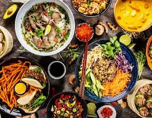
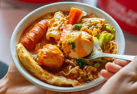
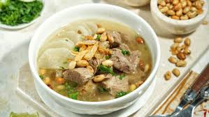
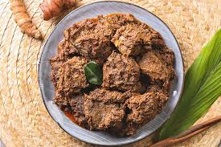
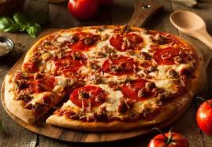
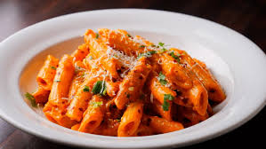
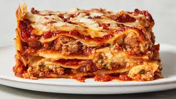
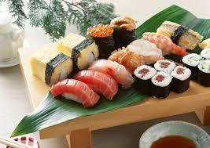
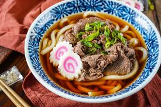
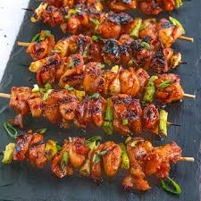

# Masakan Internasional 

Masakan internasional adalah hidangan dan gaya memasak yang berasal dari satu negara atau budaya, namun dikenal dan dinikmati secara luas di seluruh dunia. Ciri khasnya adalah identik dengan negara asalnya melalui bahan, teknik pengolahan, dan bumbu tertentu, serta sering kali diakui oleh negara lain sebagai makanan asli dari wilayah tersebut.

## Masakan Indonesia

- **Seblak:** Makanan khas Jawa Barat yang terbuat dari kerupuk basah yang dimasak dengan bumbu pedas dan gurih, terutama kencur.

   [Sumber Foto](https://share.google/images/rNY7alR3DidXoQJfL)

---
- **Soto:** Sup tradisional Indonesia yang terbuat dari kaldu daging dan rempah-rempah, disajikan dengan nasi, lontong, atau bihun.

  [Sumber Foto](https://share.google/images/YWnc91lLWI4ZykU3D)

---
- **Rendang:** Hidangan khas Minangkabau, Indonesia, yang terbuat dari daging yang dimasak secara perlahan dalam santan dan aneka rempah-rempah.

  [Sumber Foto](https://share.google/images/gr0q2kFKX74JkUWOo)

---
## Masakan Italia

- **Pizza:** Hidangan gurih dari Italia berupa adonan bundar dan pipih yang dipanggang dalam oven, lalu diberi saus tomat, keju mozzarella, dan berbagai bahan tambahan seperti daging, sayuran, atau buah di atasnya.

  [Sumber Foto](https://share.google/images/81Dm6Hbzn1rgyEySP)

---
- **Pasta:** Makanan pokok Italia yang terbuat dari adonan tepung gandum durum (semolina), air, dan kadang-kadang telur, yang kemudian dibentuk menjadi berbagai ukuran dan bentuk seperti spaghetti, fettuccine, atau penne, dan biasanya dimasak dengan cara direbus.

  [Sumber Foto](https://share.google/images/2MglOiVQxl0RVRRj)

---
- **Lasagna:** Hidangan pasta panggang tradisional Italia yang terdiri dari lapisan-lapisan lembaran pasta, saus, keju, dan bahan-bahan lainnya.

  [Sumber Foto](https://share.google/images/ukChHJFglApA4lA6n)

---
## Masakan Jepang
- **Sushi:** Sushi adalah hidangan Jepang yang terdiri dari nasi yang dibumbui cuka, garam, dan gula (_shari_) dengan lauk (neta) berupa makanan laut (mentah atau matang), sayuran, atau bahan lainnya.

  [Sumber Foto](https://share.google/images/KAIBxycBxp8yqVZI7)

---
- **Udon:** Udon adalah salah satu jenis mi yang sudah dikenal di Jepang sejak dulu, dibuat dari tepung terigu dan berbentuk tebal serta agak lebar.

  [Sumber Foto](https://share.google/images/t5xAfc1pKTEIB2VL5)

---
- **Yakitori:** Yakitori adalah sate khas dari Jepang yang  menggunakan ayam.

  [Sumber Foto](https://share.google/images/pDL1mpXeMQI4uLtiv)
---
